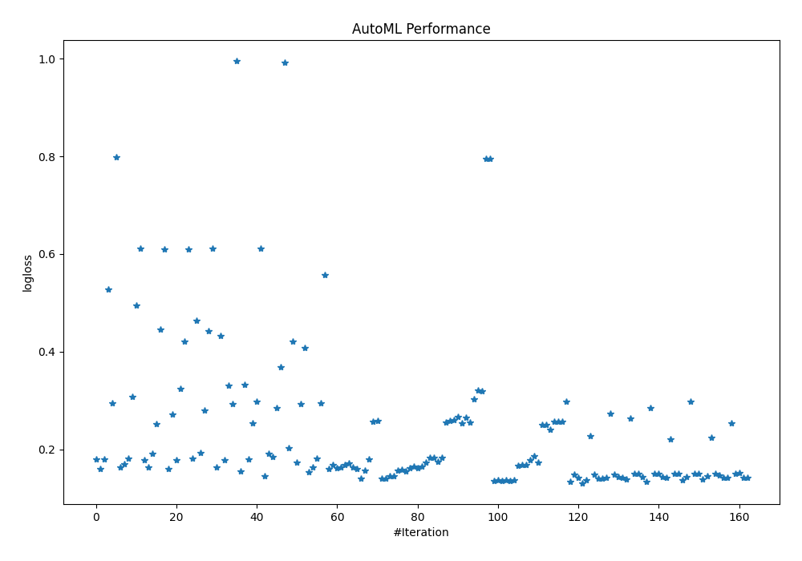
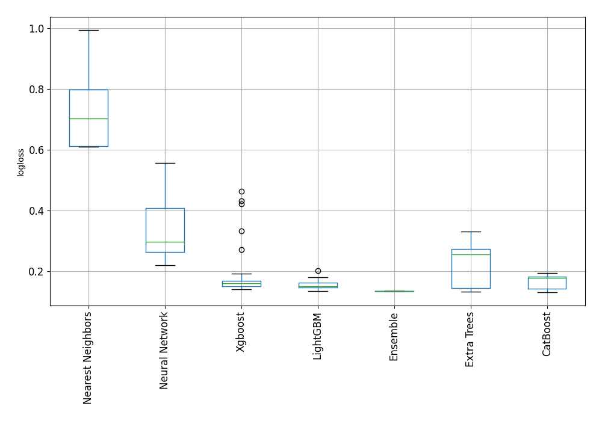

# AutoML Leaderboard

| Best model   | name                                                                                               | model_type        | metric_type   |   metric_value |   train_time |
|:-------------|:---------------------------------------------------------------------------------------------------|:------------------|:--------------|---------------:|-------------:|
|              | [1_Default_LightGBM](1_Default_LightGBM/README.md)                                                 | LightGBM          | logloss       |       0.179848 |        11.16 |
|              | [2_Default_Xgboost](2_Default_Xgboost/README.md)                                                   | Xgboost           | logloss       |       0.16066  |        10.9  |
|              | [3_Default_CatBoost](3_Default_CatBoost/README.md)                                                 | CatBoost          | logloss       |       0.180381 |        21.72 |
|              | [4_Default_NeuralNetwork](4_Default_NeuralNetwork/README.md)                                       | Neural Network    | logloss       |       0.527739 |        10.87 |
|              | [5_Default_ExtraTrees](5_Default_ExtraTrees/README.md)                                             | Extra Trees       | logloss       |       0.294304 |        24.74 |
|              | [6_Default_NearestNeighbors](6_Default_NearestNeighbors/README.md)                                 | Nearest Neighbors | logloss       |       0.797994 |         9.02 |
|              | [16_LightGBM](16_LightGBM/README.md)                                                               | LightGBM          | logloss       |       0.162881 |         8.82 |
|              | [7_Xgboost](7_Xgboost/README.md)                                                                   | Xgboost           | logloss       |       0.169496 |        11.38 |
|              | [25_CatBoost](25_CatBoost/README.md)                                                               | CatBoost          | logloss       |       0.181649 |       142.12 |
|              | [34_ExtraTrees](34_ExtraTrees/README.md)                                                           | Extra Trees       | logloss       |       0.308076 |        22    |
|              | [43_NeuralNetwork](43_NeuralNetwork/README.md)                                                     | Neural Network    | logloss       |       0.493951 |        11.18 |
|              | [52_NearestNeighbors](52_NearestNeighbors/README.md)                                               | Nearest Neighbors | logloss       |       0.612005 |         9.89 |
|              | [17_LightGBM](17_LightGBM/README.md)                                                               | LightGBM          | logloss       |       0.177179 |         9.62 |
|              | [8_Xgboost](8_Xgboost/README.md)                                                                   | Xgboost           | logloss       |       0.163039 |        12.41 |
|              | [26_CatBoost](26_CatBoost/README.md)                                                               | CatBoost          | logloss       |       0.191351 |        70.73 |
|              | [35_ExtraTrees](35_ExtraTrees/README.md)                                                           | Extra Trees       | logloss       |       0.251115 |        24.6  |
|              | [44_NeuralNetwork](44_NeuralNetwork/README.md)                                                     | Neural Network    | logloss       |       0.446188 |        13.16 |
|              | [53_NearestNeighbors](53_NearestNeighbors/README.md)                                               | Nearest Neighbors | logloss       |       0.609799 |        11.14 |
|              | [18_LightGBM](18_LightGBM/README.md)                                                               | LightGBM          | logloss       |       0.159954 |        11.68 |
|              | [9_Xgboost](9_Xgboost/README.md)                                                                   | Xgboost           | logloss       |       0.270752 |        10.9  |
|              | [27_CatBoost](27_CatBoost/README.md)                                                               | CatBoost          | logloss       |       0.177516 |        33.43 |
|              | [36_ExtraTrees](36_ExtraTrees/README.md)                                                           | Extra Trees       | logloss       |       0.323945 |        27.08 |
|              | [45_NeuralNetwork](45_NeuralNetwork/README.md)                                                     | Neural Network    | logloss       |       0.421164 |        14.41 |
|              | [54_NearestNeighbors](54_NearestNeighbors/README.md)                                               | Nearest Neighbors | logloss       |       0.609799 |        12.15 |
|              | [19_LightGBM](19_LightGBM/README.md)                                                               | LightGBM          | logloss       |       0.181066 |        13.52 |
|              | [10_Xgboost](10_Xgboost/README.md)                                                                 | Xgboost           | logloss       |       0.463749 |        11.35 |
|              | [28_CatBoost](28_CatBoost/README.md)                                                               | CatBoost          | logloss       |       0.193207 |        57.86 |
|              | [37_ExtraTrees](37_ExtraTrees/README.md)                                                           | Extra Trees       | logloss       |       0.280414 |        28.61 |
|              | [46_NeuralNetwork](46_NeuralNetwork/README.md)                                                     | Neural Network    | logloss       |       0.443016 |        14.49 |
|              | [55_NearestNeighbors](55_NearestNeighbors/README.md)                                               | Nearest Neighbors | logloss       |       0.612005 |        13    |
|              | [20_LightGBM](20_LightGBM/README.md)                                                               | LightGBM          | logloss       |       0.163755 |        12.35 |
|              | [11_Xgboost](11_Xgboost/README.md)                                                                 | Xgboost           | logloss       |       0.432608 |        12.39 |
|              | [29_CatBoost](29_CatBoost/README.md)                                                               | CatBoost          | logloss       |       0.17769  |        32.73 |
|              | [38_ExtraTrees](38_ExtraTrees/README.md)                                                           | Extra Trees       | logloss       |       0.330896 |        28.49 |
|              | [47_NeuralNetwork](47_NeuralNetwork/README.md)                                                     | Neural Network    | logloss       |       0.293007 |        16.43 |
|              | [56_NearestNeighbors](56_NearestNeighbors/README.md)                                               | Nearest Neighbors | logloss       |       0.994708 |        17.74 |
|              | [21_LightGBM](21_LightGBM/README.md)                                                               | LightGBM          | logloss       |       0.155171 |        15.64 |
|              | [12_Xgboost](12_Xgboost/README.md)                                                                 | Xgboost           | logloss       |       0.332543 |        14.07 |
|              | [30_CatBoost](30_CatBoost/README.md)                                                               | CatBoost          | logloss       |       0.179325 |        21.27 |
|              | [39_ExtraTrees](39_ExtraTrees/README.md)                                                           | Extra Trees       | logloss       |       0.254175 |        28.97 |
|              | [48_NeuralNetwork](48_NeuralNetwork/README.md)                                                     | Neural Network    | logloss       |       0.297552 |        16.52 |
|              | [57_NearestNeighbors](57_NearestNeighbors/README.md)                                               | Nearest Neighbors | logloss       |       0.612005 |        14.55 |
|              | [22_LightGBM](22_LightGBM/README.md)                                                               | LightGBM          | logloss       |       0.145735 |        14.72 |
|              | [13_Xgboost](13_Xgboost/README.md)                                                                 | Xgboost           | logloss       |       0.191681 |        15.95 |
|              | [31_CatBoost](31_CatBoost/README.md)                                                               | CatBoost          | logloss       |       0.18473  |       166.49 |
|              | [40_ExtraTrees](40_ExtraTrees/README.md)                                                           | Extra Trees       | logloss       |       0.283965 |        29.78 |
|              | [49_NeuralNetwork](49_NeuralNetwork/README.md)                                                     | Neural Network    | logloss       |       0.368885 |        16.93 |
|              | [58_NearestNeighbors](58_NearestNeighbors/README.md)                                               | Nearest Neighbors | logloss       |       0.991859 |        15.52 |
|              | [23_LightGBM](23_LightGBM/README.md)                                                               | LightGBM          | logloss       |       0.202568 |        15.18 |
|              | [14_Xgboost](14_Xgboost/README.md)                                                                 | Xgboost           | logloss       |       0.42103  |        15.12 |
|              | [32_CatBoost](32_CatBoost/README.md)                                                               | CatBoost          | logloss       |       0.172697 |        49.93 |
|              | [41_ExtraTrees](41_ExtraTrees/README.md)                                                           | Extra Trees       | logloss       |       0.29363  |        30.96 |
|              | [50_NeuralNetwork](50_NeuralNetwork/README.md)                                                     | Neural Network    | logloss       |       0.408121 |        19    |
|              | [24_LightGBM](24_LightGBM/README.md)                                                               | LightGBM          | logloss       |       0.152652 |        16.12 |
|              | [15_Xgboost](15_Xgboost/README.md)                                                                 | Xgboost           | logloss       |       0.162881 |        19.9  |
|              | [33_CatBoost](33_CatBoost/README.md)                                                               | CatBoost          | logloss       |       0.180771 |        98.35 |
|              | [42_ExtraTrees](42_ExtraTrees/README.md)                                                           | Extra Trees       | logloss       |       0.294661 |        33.9  |
|              | [51_NeuralNetwork](51_NeuralNetwork/README.md)                                                     | Neural Network    | logloss       |       0.557272 |        18.87 |
|              | [2_Default_Xgboost_categorical_mix](2_Default_Xgboost_categorical_mix/README.md)                   | Xgboost           | logloss       |       0.16066  |        21.03 |
|              | [22_LightGBM_GoldenFeatures](22_LightGBM_GoldenFeatures/README.md)                                 | LightGBM          | logloss       |       0.168318 |        35.27 |
|              | [24_LightGBM_GoldenFeatures](24_LightGBM_GoldenFeatures/README.md)                                 | LightGBM          | logloss       |       0.16167  |        19.96 |
|              | [21_LightGBM_GoldenFeatures](21_LightGBM_GoldenFeatures/README.md)                                 | LightGBM          | logloss       |       0.16281  |        18.75 |
|              | [22_LightGBM_KMeansFeatures](22_LightGBM_KMeansFeatures/README.md)                                 | LightGBM          | logloss       |       0.167765 |        20.75 |
|              | [24_LightGBM_KMeansFeatures](24_LightGBM_KMeansFeatures/README.md)                                 | LightGBM          | logloss       |       0.170593 |        20.35 |
|              | [21_LightGBM_KMeansFeatures](21_LightGBM_KMeansFeatures/README.md)                                 | LightGBM          | logloss       |       0.163975 |        22.29 |
|              | [22_LightGBM_RandomFeature](22_LightGBM_RandomFeature/README.md)                                   | LightGBM          | logloss       |       0.160433 |        39.59 |
|              | [22_LightGBM_SelectedFeatures](22_LightGBM_SelectedFeatures/README.md)                             | LightGBM          | logloss       |       0.140753 |        18.94 |
|              | [2_Default_Xgboost_SelectedFeatures](2_Default_Xgboost_SelectedFeatures/README.md)                 | Xgboost           | logloss       |       0.156196 |        22.11 |
|              | [32_CatBoost_SelectedFeatures](32_CatBoost_SelectedFeatures/README.md)                             | CatBoost          | logloss       |       0.17931  |        39.85 |
|              | [35_ExtraTrees_SelectedFeatures](35_ExtraTrees_SelectedFeatures/README.md)                         | Extra Trees       | logloss       |       0.25722  |        22.91 |
|              | [47_NeuralNetwork_SelectedFeatures](47_NeuralNetwork_SelectedFeatures/README.md)                   | Neural Network    | logloss       |       0.258956 |        21.33 |
|              | [59_LightGBM_SelectedFeatures](59_LightGBM_SelectedFeatures/README.md)                             | LightGBM          | logloss       |       0.140753 |        18.24 |
|              | [60_LightGBM_SelectedFeatures](60_LightGBM_SelectedFeatures/README.md)                             | LightGBM          | logloss       |       0.140753 |        18.64 |
|              | [61_LightGBM](61_LightGBM/README.md)                                                               | LightGBM          | logloss       |       0.145735 |        19.71 |
|              | [62_LightGBM](62_LightGBM/README.md)                                                               | LightGBM          | logloss       |       0.145735 |        20.69 |
|              | [63_LightGBM](63_LightGBM/README.md)                                                               | LightGBM          | logloss       |       0.156868 |        20.39 |
|              | [64_Xgboost_SelectedFeatures](64_Xgboost_SelectedFeatures/README.md)                               | Xgboost           | logloss       |       0.158678 |        20.65 |
|              | [65_Xgboost_SelectedFeatures](65_Xgboost_SelectedFeatures/README.md)                               | Xgboost           | logloss       |       0.154711 |        19.67 |
|              | [66_Xgboost](66_Xgboost/README.md)                                                                 | Xgboost           | logloss       |       0.160756 |        23.78 |
|              | [67_Xgboost](67_Xgboost/README.md)                                                                 | Xgboost           | logloss       |       0.164834 |        23.74 |
|              | [68_Xgboost](68_Xgboost/README.md)                                                                 | Xgboost           | logloss       |       0.160756 |        31.48 |
|              | [69_Xgboost](69_Xgboost/README.md)                                                                 | Xgboost           | logloss       |       0.164834 |        24.65 |
|              | [70_CatBoost](70_CatBoost/README.md)                                                               | CatBoost          | logloss       |       0.172478 |        46.68 |
|              | [71_CatBoost](71_CatBoost/README.md)                                                               | CatBoost          | logloss       |       0.182283 |        92.4  |
|              | [72_CatBoost](72_CatBoost/README.md)                                                               | CatBoost          | logloss       |       0.182378 |        36.97 |
|              | [73_CatBoost](73_CatBoost/README.md)                                                               | CatBoost          | logloss       |       0.175436 |        33.16 |
|              | [74_CatBoost](74_CatBoost/README.md)                                                               | CatBoost          | logloss       |       0.182765 |        53.68 |
|              | [75_ExtraTrees](75_ExtraTrees/README.md)                                                           | Extra Trees       | logloss       |       0.25534  |        36.6  |
|              | [76_ExtraTrees](76_ExtraTrees/README.md)                                                           | Extra Trees       | logloss       |       0.258079 |        42.1  |
|              | [77_ExtraTrees](77_ExtraTrees/README.md)                                                           | Extra Trees       | logloss       |       0.259384 |        37.64 |
|              | [78_ExtraTrees_SelectedFeatures](78_ExtraTrees_SelectedFeatures/README.md)                         | Extra Trees       | logloss       |       0.267031 |        28.1  |
|              | [79_ExtraTrees_SelectedFeatures](79_ExtraTrees_SelectedFeatures/README.md)                         | Extra Trees       | logloss       |       0.253623 |        26.56 |
|              | [80_NeuralNetwork_SelectedFeatures](80_NeuralNetwork_SelectedFeatures/README.md)                   | Neural Network    | logloss       |       0.265764 |        23.89 |
|              | [81_NeuralNetwork_SelectedFeatures](81_NeuralNetwork_SelectedFeatures/README.md)                   | Neural Network    | logloss       |       0.255537 |        24.07 |
|              | [82_NeuralNetwork](82_NeuralNetwork/README.md)                                                     | Neural Network    | logloss       |       0.303302 |        25.05 |
|              | [83_NeuralNetwork](83_NeuralNetwork/README.md)                                                     | Neural Network    | logloss       |       0.321414 |        25.59 |
|              | [84_NeuralNetwork](84_NeuralNetwork/README.md)                                                     | Neural Network    | logloss       |       0.318726 |        25.65 |
|              | [85_NearestNeighbors](85_NearestNeighbors/README.md)                                               | Nearest Neighbors | logloss       |       0.795285 |        24.03 |
|              | [86_NearestNeighbors](86_NearestNeighbors/README.md)                                               | Nearest Neighbors | logloss       |       0.795285 |        23.85 |
|              | [87_LightGBM_SelectedFeatures](87_LightGBM_SelectedFeatures/README.md)                             | LightGBM          | logloss       |       0.135594 |        23.06 |
|              | [88_LightGBM_SelectedFeatures](88_LightGBM_SelectedFeatures/README.md)                             | LightGBM          | logloss       |       0.136802 |        23.1  |
|              | [89_LightGBM_SelectedFeatures](89_LightGBM_SelectedFeatures/README.md)                             | LightGBM          | logloss       |       0.135594 |        22.99 |
|              | [90_LightGBM_SelectedFeatures](90_LightGBM_SelectedFeatures/README.md)                             | LightGBM          | logloss       |       0.136802 |        23.74 |
|              | [91_LightGBM_SelectedFeatures](91_LightGBM_SelectedFeatures/README.md)                             | LightGBM          | logloss       |       0.135594 |        23.25 |
|              | [92_LightGBM_SelectedFeatures](92_LightGBM_SelectedFeatures/README.md)                             | LightGBM          | logloss       |       0.136802 |        24    |
|              | [93_Xgboost_SelectedFeatures](93_Xgboost_SelectedFeatures/README.md)                               | Xgboost           | logloss       |       0.165928 |        24.25 |
|              | [94_Xgboost_SelectedFeatures](94_Xgboost_SelectedFeatures/README.md)                               | Xgboost           | logloss       |       0.168632 |        23.91 |
|              | [95_Xgboost_SelectedFeatures](95_Xgboost_SelectedFeatures/README.md)                               | Xgboost           | logloss       |       0.168448 |        25.04 |
|              | [96_CatBoost](96_CatBoost/README.md)                                                               | CatBoost          | logloss       |       0.17797  |        41.62 |
|              | [97_CatBoost](97_CatBoost/README.md)                                                               | CatBoost          | logloss       |       0.18646  |        59.29 |
|              | [98_CatBoost](98_CatBoost/README.md)                                                               | CatBoost          | logloss       |       0.172389 |        37.38 |
|              | [99_ExtraTrees](99_ExtraTrees/README.md)                                                           | Extra Trees       | logloss       |       0.249841 |        43.58 |
|              | [100_ExtraTrees](100_ExtraTrees/README.md)                                                         | Extra Trees       | logloss       |       0.250696 |        37.7  |
|              | [101_ExtraTrees_SelectedFeatures](101_ExtraTrees_SelectedFeatures/README.md)                       | Extra Trees       | logloss       |       0.240118 |        27.4  |
|              | [102_ExtraTrees_SelectedFeatures](102_ExtraTrees_SelectedFeatures/README.md)                       | Extra Trees       | logloss       |       0.256115 |        35.47 |
|              | [103_ExtraTrees](103_ExtraTrees/README.md)                                                         | Extra Trees       | logloss       |       0.25681  |        40.63 |
|              | [104_ExtraTrees](104_ExtraTrees/README.md)                                                         | Extra Trees       | logloss       |       0.257057 |        39.02 |
|              | [105_NeuralNetwork_SelectedFeatures](105_NeuralNetwork_SelectedFeatures/README.md)                 | Neural Network    | logloss       |       0.298608 |        26.12 |
|              | [Ensemble](Ensemble/README.md)                                                                     | Ensemble          | logloss       |       0.133958 |        93.88 |
|              | [91_LightGBM_SelectedFeatures_Stacked](91_LightGBM_SelectedFeatures_Stacked/README.md)             | LightGBM          | logloss       |       0.148744 |        30.18 |
|              | [65_Xgboost_SelectedFeatures_Stacked](65_Xgboost_SelectedFeatures_Stacked/README.md)               | Xgboost           | logloss       |       0.141369 |        27.16 |
| **the best** | [98_CatBoost_Stacked](98_CatBoost_Stacked/README.md)                                               | CatBoost          | logloss       |       0.130972 |        41.15 |
|              | [101_ExtraTrees_SelectedFeatures_Stacked](101_ExtraTrees_SelectedFeatures_Stacked/README.md)       | Extra Trees       | logloss       |       0.137185 |        33.66 |
|              | [81_NeuralNetwork_SelectedFeatures_Stacked](81_NeuralNetwork_SelectedFeatures_Stacked/README.md)   | Neural Network    | logloss       |       0.227328 |        30.17 |
|              | [87_LightGBM_SelectedFeatures_Stacked](87_LightGBM_SelectedFeatures_Stacked/README.md)             | LightGBM          | logloss       |       0.148744 |        26.35 |
|              | [2_Default_Xgboost_SelectedFeatures_Stacked](2_Default_Xgboost_SelectedFeatures_Stacked/README.md) | Xgboost           | logloss       |       0.140621 |        28.25 |
|              | [70_CatBoost_Stacked](70_CatBoost_Stacked/README.md)                                               | CatBoost          | logloss       |       0.141033 |        46.77 |
|              | [99_ExtraTrees_Stacked](99_ExtraTrees_Stacked/README.md)                                           | Extra Trees       | logloss       |       0.141264 |        45.87 |
|              | [47_NeuralNetwork_SelectedFeatures_Stacked](47_NeuralNetwork_SelectedFeatures_Stacked/README.md)   | Neural Network    | logloss       |       0.273286 |        29.29 |
|              | [89_LightGBM_SelectedFeatures_Stacked](89_LightGBM_SelectedFeatures_Stacked/README.md)             | LightGBM          | logloss       |       0.148744 |        27.15 |
|              | [64_Xgboost_SelectedFeatures_Stacked](64_Xgboost_SelectedFeatures_Stacked/README.md)               | Xgboost           | logloss       |       0.142734 |        29.5  |
|              | [32_CatBoost_Stacked](32_CatBoost_Stacked/README.md)                                               | CatBoost          | logloss       |       0.142433 |        57.21 |
|              | [100_ExtraTrees_Stacked](100_ExtraTrees_Stacked/README.md)                                         | Extra Trees       | logloss       |       0.138613 |        49.81 |
|              | [80_NeuralNetwork_SelectedFeatures_Stacked](80_NeuralNetwork_SelectedFeatures_Stacked/README.md)   | Neural Network    | logloss       |       0.264017 |        30.87 |
|              | [92_LightGBM_SelectedFeatures_Stacked](92_LightGBM_SelectedFeatures_Stacked/README.md)             | LightGBM          | logloss       |       0.150227 |        28.32 |
|              | [2_Default_Xgboost_categorical_mix_Stacked](2_Default_Xgboost_categorical_mix_Stacked/README.md)   | Xgboost           | logloss       |       0.150574 |        32.5  |
|              | [73_CatBoost_Stacked](73_CatBoost_Stacked/README.md)                                               | CatBoost          | logloss       |       0.143097 |        39.79 |
|              | [35_ExtraTrees_Stacked](35_ExtraTrees_Stacked/README.md)                                           | Extra Trees       | logloss       |       0.132973 |        49.22 |
|              | [47_NeuralNetwork_Stacked](47_NeuralNetwork_Stacked/README.md)                                     | Neural Network    | logloss       |       0.285347 |        32.86 |
|              | [90_LightGBM_SelectedFeatures_Stacked](90_LightGBM_SelectedFeatures_Stacked/README.md)             | LightGBM          | logloss       |       0.150227 |        29.31 |
|              | [2_Default_Xgboost_Stacked](2_Default_Xgboost_Stacked/README.md)                                   | Xgboost           | logloss       |       0.150574 |        32.74 |
|              | [27_CatBoost_Stacked](27_CatBoost_Stacked/README.md)                                               | CatBoost          | logloss       |       0.143101 |        56.53 |
|              | [79_ExtraTrees_SelectedFeatures_Stacked](79_ExtraTrees_SelectedFeatures_Stacked/README.md)         | Extra Trees       | logloss       |       0.14234  |        35.92 |
|              | [48_NeuralNetwork_Stacked](48_NeuralNetwork_Stacked/README.md)                                     | Neural Network    | logloss       |       0.22016  |        33.99 |
|              | [88_LightGBM_SelectedFeatures_Stacked](88_LightGBM_SelectedFeatures_Stacked/README.md)             | LightGBM          | logloss       |       0.150227 |        29.81 |
|              | [66_Xgboost_Stacked](66_Xgboost_Stacked/README.md)                                                 | Xgboost           | logloss       |       0.149428 |        35.15 |
|              | [29_CatBoost_Stacked](29_CatBoost_Stacked/README.md)                                               | CatBoost          | logloss       |       0.136826 |        47.05 |
|              | [39_ExtraTrees_Stacked](39_ExtraTrees_Stacked/README.md)                                           | Extra Trees       | logloss       |       0.143182 |        50.71 |
|              | [105_NeuralNetwork_SelectedFeatures_Stacked](105_NeuralNetwork_SelectedFeatures_Stacked/README.md) | Neural Network    | logloss       |       0.298078 |        33.29 |
|              | [60_LightGBM_SelectedFeatures_Stacked](60_LightGBM_SelectedFeatures_Stacked/README.md)             | LightGBM          | logloss       |       0.150777 |        33.2  |
|              | [68_Xgboost_Stacked](68_Xgboost_Stacked/README.md)                                                 | Xgboost           | logloss       |       0.149428 |        35.57 |
|              | [96_CatBoost_Stacked](96_CatBoost_Stacked/README.md)                                               | CatBoost          | logloss       |       0.138515 |        48.8  |
|              | [75_ExtraTrees_Stacked](75_ExtraTrees_Stacked/README.md)                                           | Extra Trees       | logloss       |       0.144851 |        53    |
|              | [82_NeuralNetwork_Stacked](82_NeuralNetwork_Stacked/README.md)                                     | Neural Network    | logloss       |       0.223218 |        34.53 |
|              | [59_LightGBM_SelectedFeatures_Stacked](59_LightGBM_SelectedFeatures_Stacked/README.md)             | LightGBM          | logloss       |       0.150777 |        30.57 |
|              | [15_Xgboost_Stacked](15_Xgboost_Stacked/README.md)                                                 | Xgboost           | logloss       |       0.146229 |        35.83 |
|              | [32_CatBoost_SelectedFeatures_Stacked](32_CatBoost_SelectedFeatures_Stacked/README.md)             | CatBoost          | logloss       |       0.14199  |        53.79 |
|              | [102_ExtraTrees_SelectedFeatures_Stacked](102_ExtraTrees_SelectedFeatures_Stacked/README.md)       | Extra Trees       | logloss       |       0.142246 |        37.72 |
|              | [84_NeuralNetwork_Stacked](84_NeuralNetwork_Stacked/README.md)                                     | Neural Network    | logloss       |       0.25349  |        35.18 |
|              | [22_LightGBM_SelectedFeatures_Stacked](22_LightGBM_SelectedFeatures_Stacked/README.md)             | LightGBM          | logloss       |       0.150777 |        32.16 |
|              | [8_Xgboost_Stacked](8_Xgboost_Stacked/README.md)                                                   | Xgboost           | logloss       |       0.151079 |        34.95 |
|              | [30_CatBoost_Stacked](30_CatBoost_Stacked/README.md)                                               | CatBoost          | logloss       |       0.142522 |        38.81 |
|              | [103_ExtraTrees_Stacked](103_ExtraTrees_Stacked/README.md)                                         | Extra Trees       | logloss       |       0.142302 |        50.79 |

### AutoML Performance

### AutoML Performance Boxplot
